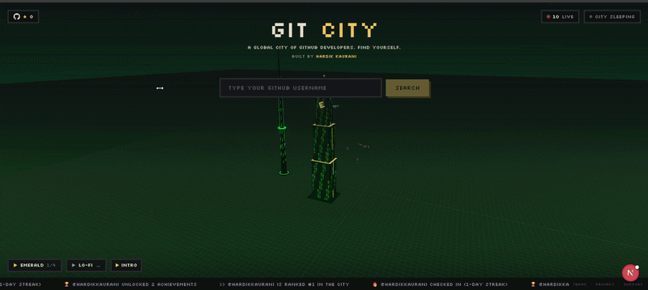
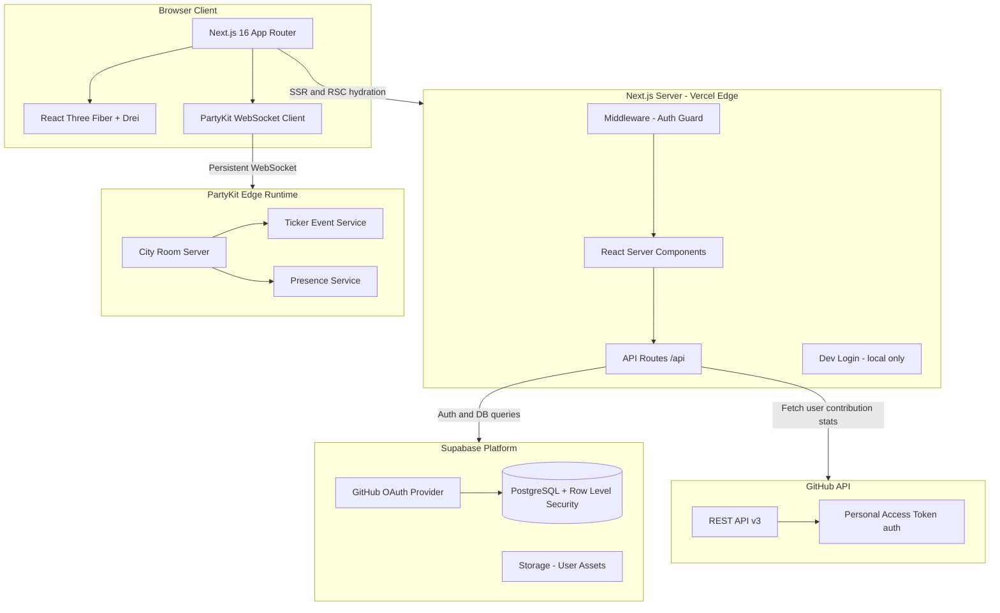
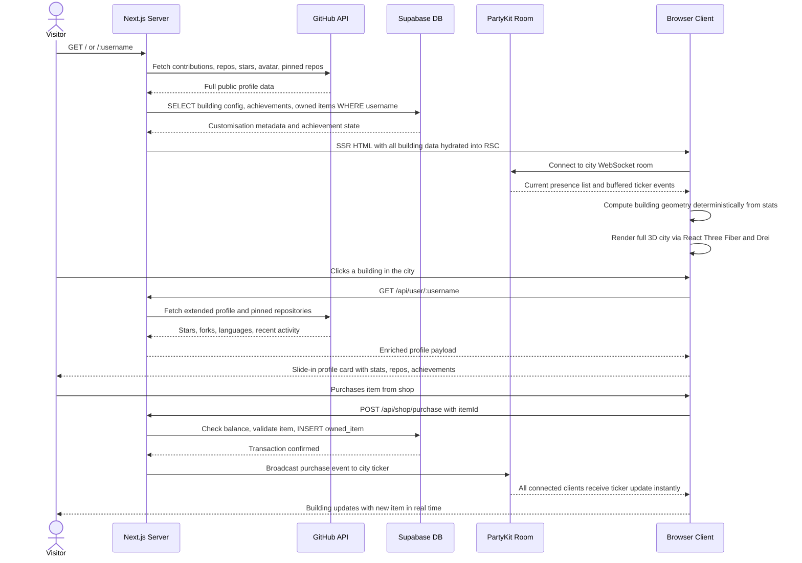
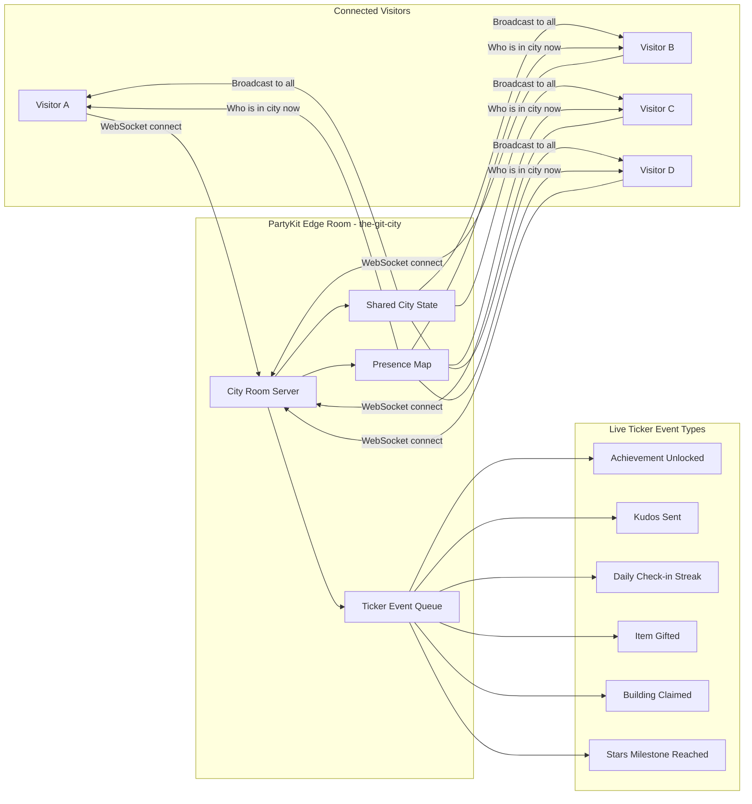
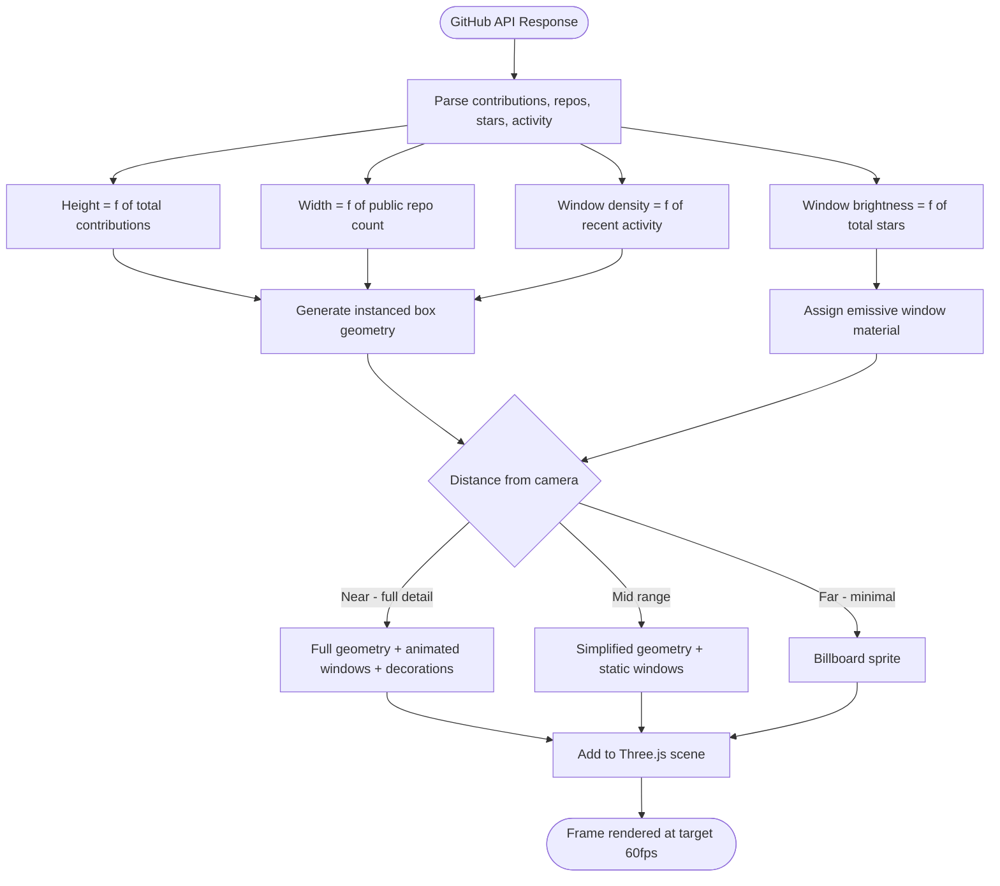
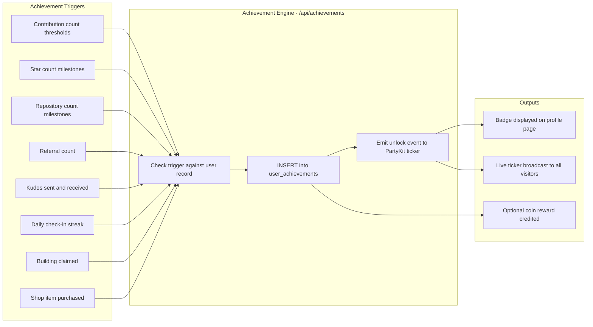

<h1 align="center">Git City !</h1>

<p align="center">
  <a href="https://the-git-city-dn5jb2ak5-hardikkaurani1-4236s-projects.vercel.app" target="_blank">
    
  </a>
</p>

<p align="center">
  <sub>Click the image to open Git City</sub>
</p>

<br/>

<p align="center">
  <strong>Your GitHub profile as a 3D pixel art building in an interactive city.</strong><br/>
  The more you contribute, the taller your building grows.
</p>

<br/>

<p align="center">
  <a href="https://the-git-city.vercel.app">
    
  </a>
  <a href="LICENSE">
    
  </a>
  
  
  
  
  
  
  
</p>

---

## Walkthrough

<p align="center">

https://github.com/hardikkaurani/Git-City/assets/YOUR_USER_ID/walkthrough.mp4

</p>

> **How to embed your video**: open any issue in this repo, drag-and-drop your `.mp4` file into the comment box, wait for the upload URL to appear, copy it, then close the issue without submitting. Paste that URL above and GitHub renders a native inline video player.

---

## Table of Contents

- [What is Git City](#what-is-git-city)
- [Features](#features)
- [How Buildings Work](#how-buildings-work)
- [System Architecture](#system-architecture)
- [Data Flow](#data-flow)
- [Realtime Architecture](#realtime-architecture)
- [Building Render Pipeline](#building-render-pipeline)
- [Achievement System](#achievement-system)
- [Tech Stack](#tech-stack)
- [Project Structure](#project-structure)
- [Prerequisites](#prerequisites)
- [Getting Started](#getting-started)
- [Local Supabase Setup](#local-supabase--no-remote-project-needed)
- [Environment Configuration](#environment-configuration)
- [API Reference](#api-reference)
- [Deployment](#deployment)
- [Contributing](#contributing)
- [License](#license)

---

## What is Git City?

Git City transforms every GitHub profile into a unique pixel art building inside a shared, real-time 3D world. Building dimensions are computed deterministically from a developer's public GitHub data — so the same developer always produces the same building, with no stored geometry or pre-baked assets.

The city is live and multiplayer. Every visitor sees the same world simultaneously via WebSocket connections. Developers can walk through the city, switch to free-flight mode, visit any profile page, unlock achievements, customise their building through the shop, send kudos to other developers, and compete on the global leaderboard.

**Live at**: [https://the-git-city.vercel.app](https://the-git-city.vercel.app)

---

## Features

- **3D Pixel Art Buildings** — Each GitHub user becomes a unique building with height driven by contributions, width by public repos, and window illumination by recent activity
- **Free Flight Mode** — Smooth camera controls let you fly through the entire skyline, zoom into any building, and explore the city from any angle
- **Profile Pages** — Dedicated route per developer showing stats, pinned repositories, achievements, and owned shop items
- **Achievement System** — Unlock achievements based on contributions, stars received, repos created, referrals made, and social interactions
- **Building Customization** — Claim your building and equip items from the shop: crowns, auras, roof effects, and face decorations — all visible to every visitor in real time
- **Social Features** — Send kudos to other developers, gift shop items, refer friends to the city, and watch a live activity feed scroll across the bottom of the screen
- **Compare Mode** — Place two developers side by side and compare their buildings, contribution graphs, and stats
- **Share Cards** — Export your profile as a downloadable image card in landscape or stories format — shareable to any platform
- **Live Ticker** — A persistent bottom bar broadcasts real-time events across all connected clients: achievements unlocked, stars given, check-in streaks, and more
- **Admin Panel** — Restricted `/admin/ads` route for managing sponsored building placements

---

## How Buildings Work

| Metric | Affects | Example |
|---|---|---|
| Contributions | Building height | 1,000 commits = taller building |
| Public repos | Building width | More repos = wider base |
| Stars received | Window brightness | More stars = more lit windows |
| Recent activity | Window glow pattern | Active this week = distinct animated glow |
| Owned shop items | Visual decorations | Crown, aura, roof effects applied on top |

Buildings are rendered with Three.js instanced meshes and a LOD (Level of Detail) system. Buildings close to the camera render at full fidelity with animated windows. Distant buildings switch to simplified geometry automatically to maintain frame rate across a city of hundreds of developers.

The building generation algorithm is purely deterministic — given the same GitHub username and the same API response, the output geometry is always identical. There are no stored 3D models, no per-user assets. Everything is computed at render time from live data.

---

## System Architecture



---

## Data Flow



---

## Realtime Architecture



---

## Building Render Pipeline



---

## Achievement System



---

## Tech Stack

### Frontend

| Technology | Version | Purpose |
|---|---|---|
| Next.js | 16 | React framework — App Router, Turbopack, RSC |
| React Three Fiber | Latest | Declarative Three.js bindings for React |
| Drei | Latest | Three.js helpers — controls, LOD, instances |
| Three.js | Latest | Core 3D engine — geometry, materials, renderer |
| Tailwind CSS | v4 | Utility-first styling |
| Silkscreen | Font | Pixel art display font |
| TypeScript | Latest | Type-safe application code |

### Backend and Data

| Technology | Purpose |
|---|---|
| Supabase | PostgreSQL database, GitHub OAuth, Row Level Security, storage |
| PartyKit | Edge-deployed WebSocket rooms for real-time multiplayer |
| GitHub REST API v3 | Contribution stats, repo data, avatars, pinned repos |


### Infrastructure

| Technology | Purpose |
|---|---|
| Vercel | Next.js hosting, edge functions, auto-deploy on push to main |
| Supabase Migrations | SQL-based schema version control |
| ESLint | Static code analysis |

---

## Project Structure

```
Git-City/
|
+-- src/
|   +-- app/                         # Next.js App Router
|   |   +-- page.tsx                 # Home - city canvas and search input
|   |   +-- [username]/              # Dynamic developer profile pages
|   |   +-- shop/                    # Building customisation shop
|   |   +-- leaderboard/             # Global contribution leaderboard
|   |   +-- compare/                 # Side-by-side developer comparison
|   |   +-- admin/
|   |   |   +-- ads/                 # Admin-only ad management panel
|   |   +-- api/
|   |       +-- user/[username]/     # GitHub stats fetch and enrichment
|   |       +-- shop/purchase/       # Shop transaction endpoint
|   |       +-- achievements/        # Achievement check and unlock
|   |       +-- kudos/               # Send kudos to developer
|   |       +-- checkin/             # Daily check-in streak
|   |       +-- leaderboard/         # Leaderboard data aggregation
|   |       +-- dev/login/           # Local dev login - disabled in production
|   |
|   +-- components/
|   |   +-- city/                    # CityCanvas, Building, Camera, LOD, Skybox
|   |   +-- ui/                      # Button, Card, Modal, Badge, Tooltip
|   |   +-- ticker/                  # LiveTicker - scrolling event bar
|   |   +-- profile/                 # ProfileCard, ShareCard, AchievementBadge
|   |   +-- shop/                    # ShopGrid, ItemCard, PurchaseModal
|   |   +-- compare/                 # CompareLayout, StatBar
|   |
|   +-- lib/
|       +-- github.ts                # GitHub API client wrapper
|       +-- supabase/
|       |   +-- client.ts            # Browser Supabase client
|       |   +-- server.ts            # Server Supabase client with service role
|       +-- building.ts              # Deterministic building geometry generator
|       +-- achievements.ts          # Achievement definitions and unlock logic
|       +-- partykit.ts              # PartyKit client helpers
|
+-- supabase/
|   +-- migrations/                  # Ordered SQL migration files
|   +-- seed.sql                     # Development seed data
|   +-- config.toml                  # Local Supabase stack config
|
+-- public/
|   +-- og-image.png                 # OG image - clickable README banner
|   +-- fonts/                       # Silkscreen pixel font files
|
+-- .env.example                     # Environment variable template with all keys
+-- next.config.ts                   # Next.js config - headers, rewrites, images
+-- partykit.json                    # PartyKit room deployment config
+-- package.json
+-- README.md
```

---

## Prerequisites

| Requirement | Version | Notes |
|---|---|---|
| Node.js | v18+ | [nodejs.org](https://nodejs.org/) |
| npm | v9+ | Bundled with Node.js |
| Supabase CLI | Latest | `npm install -g supabase` |
| Docker or Colima | Latest | Required for local Supabase stack |
| GitHub OAuth App | - | Settings > Developer settings > OAuth Apps |

---

## Getting Started

```bash
# Clone the repo
git clone https://github.com/hardikkaurani/Git-City.git
cd Git-City

# Install dependencies
npm install

# Set up environment variables
# Linux / macOS
cp .env.example .env.local

# Windows (Command Prompt)
copy .env.example .env.local

# Windows (PowerShell)
Copy-Item .env.example .env.local

# Fill in .env.local, then run the dev server
npm run dev
```

Open [http://localhost:3001](http://localhost:3001) to see the city.

---

## Local Supabase — No Remote Project Needed

Run the entire backend locally with no Supabase account and no GitHub OAuth app.

**Step 1 — Install a container runtime and the Supabase CLI:**

```bash
# macOS — Colima is a lightweight, free Docker alternative
brew install colima docker supabase/tap/supabase
colima start

# Or use Docker Desktop, then:
brew install supabase/tap/supabase
```

**Step 2 — Start the local stack:**

```bash
supabase start     # first run pulls images and applies all migrations
supabase status    # re-print the local URL and keys at any time
```

**Step 3 — Point `.env.local` at the printed values:**

```env
NEXT_PUBLIC_SUPABASE_URL=http://127.0.0.1:54321
NEXT_PUBLIC_SUPABASE_ANON_KEY=<Publishable key from supabase status>
SUPABASE_SERVICE_ROLE_KEY=<Secret key from supabase status>
```

**Local login (zero config):** GitHub OAuth is not available in a local stack. Clicking **Sign in with GitHub** redirects to a built-in dev login page — type any GitHub username and you are signed in instantly, with a building generated from that account's public data. You can also navigate directly to [http://localhost:3001/api/dev/login](http://localhost:3001/api/dev/login). This route is automatically disabled when `NODE_ENV=production`.

**Useful commands:**

```bash
supabase db reset    # wipe and re-apply all migrations on a clean database
supabase stop        # stop all containers (data is preserved in volumes)
```

Supabase Studio (database browser) is available at [http://127.0.0.1:54323](http://127.0.0.1:54323).

---

## Environment Configuration

```bash
cp .env.example .env.local
```

```env
# ── App ───────────────────────────────────────────────────────────────────────
NEXT_PUBLIC_BASE_URL=http://localhost:3001

# ── Supabase ──────────────────────────────────────────────────────────────────
# Project Settings -> API in your Supabase dashboard
NEXT_PUBLIC_SUPABASE_URL=https://your-project.supabase.co
NEXT_PUBLIC_SUPABASE_ANON_KEY=your-anon-key
SUPABASE_SERVICE_ROLE_KEY=your-service-role-key

# ── GitHub ────────────────────────────────────────────────────────────────────
# Settings -> Developer settings -> Personal access tokens -> Fine-grained (recommended)
GITHUB_TOKEN=ghp_your-github-token

# ── Admin ─────────────────────────────────────────────────────────────────────
# Comma-separated GitHub usernames allowed to access /admin/ads
ADMIN_GITHUB_LOGINS=hardikkaurani

```

> Configure GitHub OAuth in Supabase under **Authentication > Providers > GitHub**. Add `http://localhost:3001/auth/callback` as a redirect URL for local development and `https://the-git-city.vercel.app/auth/callback` for production.

---

## API Reference

All endpoints are under `/api`. Protected routes require a valid Supabase session cookie.

| Method | Endpoint | Auth | Description |
|---|---|---|---|
| `GET` | `/api/user/:username` | No | Fetch GitHub stats, building config, achievements |
| `GET` | `/api/leaderboard` | No | Global leaderboard by contribution score |
| `POST` | `/api/achievements` | Yes | Check and unlock eligible achievements |
| `POST` | `/api/shop/purchase` | Yes | Purchase a shop item and apply to building |
| `POST` | `/api/kudos` | Yes | Send kudos to another developer |
| `POST` | `/api/checkin` | Yes | Daily check-in — increment streak |
| `GET` | `/api/dev/login` | No | Dev-only login (disabled in production) |

---

## Deployment

### Frontend — Vercel

1. Connect the repository to [Vercel](https://vercel.com/new)
2. Framework preset: **Next.js** (auto-detected)
3. Set all environment variables from `.env.example` in the Vercel project settings
4. Set `NEXT_PUBLIC_BASE_URL` to `https://the-git-city.vercel.app`
5. Every push to `main` triggers an automatic production deployment

### Database — Supabase

```bash
# Push all local migrations to your production Supabase project
supabase db push --db-url your-production-db-connection-string
```

### PartyKit (if self-hosting realtime)

```bash
npx partykit deploy --name the-git-city
```

Update `NEXT_PUBLIC_PARTYKIT_HOST` in Vercel environment variables to the deployed PartyKit URL.

---

## Contributing

1. Fork the repository and branch from `main`:

```bash
git checkout -b feat/your-feature-name
```

2. Follow Conventional Commits:

```
feat(city): add fog effect to distant buildings
fix(shop): prevent duplicate item purchase race condition
chore(supabase): add index on user_achievements.username
docs(readme): update environment variable descriptions
```

3. Ensure no lint errors before opening a PR:

```bash
npm run lint
```

4. Open a Pull Request against `main` with a clear description of the change and screenshots or a short video if it affects the visual output.

---

## License

[AGPL-3.0](LICENSE) — You can use and modify Git City, but any public deployment must open-source its modifications.

---

<p align="center">
  Built by <a href="https://x.com/HKaurani_01">@hardikkaurani</a> & <a href="https://github.com/apps/dependabot">Dependabot</a>
  &nbsp;·&nbsp;
  <a href="https://the-git-city.vercel.app">the-git-city.vercel.app</a>
</p>
